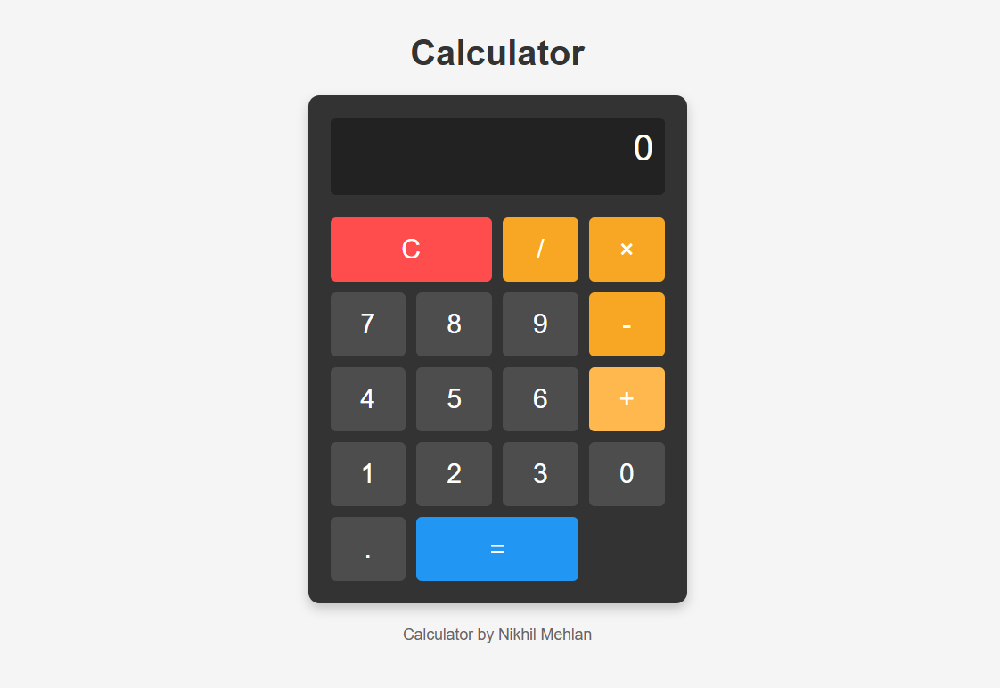

# Simple JavaScript Calculator

<p align="center">
  
</p>

## Description

A clean, user-friendly calculator built with HTML, CSS, and JavaScript. This calculator performs basic arithmetic operations (addition, subtraction, multiplication, division) with a modern interface.

## Features

- Simple and intuitive user interface
- Basic arithmetic operations (add, subtract, multiply, divide)
- Decimal point support
- Error handling for invalid calculations
- Responsive design with hover effects
- Clear functionality

## Demo

The calculator provides a clean interface with:
- A display screen showing current input and results
- Numeric keypad (0-9) 
- Operation buttons (+, -, ×, /)
- Clear button (C)
- Equals button (=)
- Decimal point button (.)

## Technologies Used

- HTML5
- CSS3 (with Grid Layout)
- JavaScript (ES6)

## Installation

1. Clone the repository:
   ```
   git clone https://github.com/nikhilmehlan/CODSOFT/Calculator.git
   ```

2. Navigate to the project directory:
   ```
   cd javascript-calculator
   ```

3. Open `index.html` in your browser.

## Usage

- Click the number buttons to input values
- Click operation buttons (+, -, ×, /) to select operations
- Press "=" to calculate the result
- Click "C" to clear the display and start over
- Use "." to add decimal points to numbers

## Project Structure

```
javascript-calculator/
├── index.html         # Main HTML file
├── assets/            # Project assets
│   └── overview.png   # Calculator overview image
└── README.md          # Project documentation
```

## Future Enhancements

- Add keyboard support
- Include scientific calculator functions
- Implement calculation history
- Add theme options

## Credits

Calculator by Nikhil Mehlan

## License

This project is open source and available under the [MIT License](LICENSE).